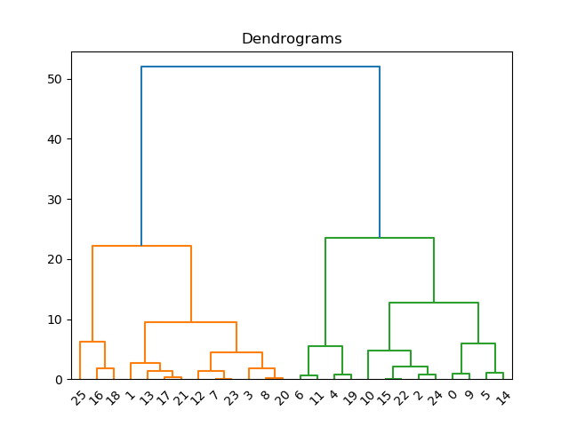

## Hierarchical Clustering

Given names and final marks (Out of 100) of students of a course at IITGN. Using a hierarchical clustering approach, assign grades to these students. Assume that the Instructor has decided to allot only A, B, C and D grades to students. How will the overall grading change if the academic office makes it mandatory to have at least ONE F grade in a course of more than 20 students? Plot the dendrogram.

The dendrogram from the code hierarchical_clustrering.py are :
    

## Radial Basis function

A Radial Basis Function (RBF) neural network was used to solve a pattern classification problem. The total number all the patterns which the network learns to classify was approximately in the order of 10^9.